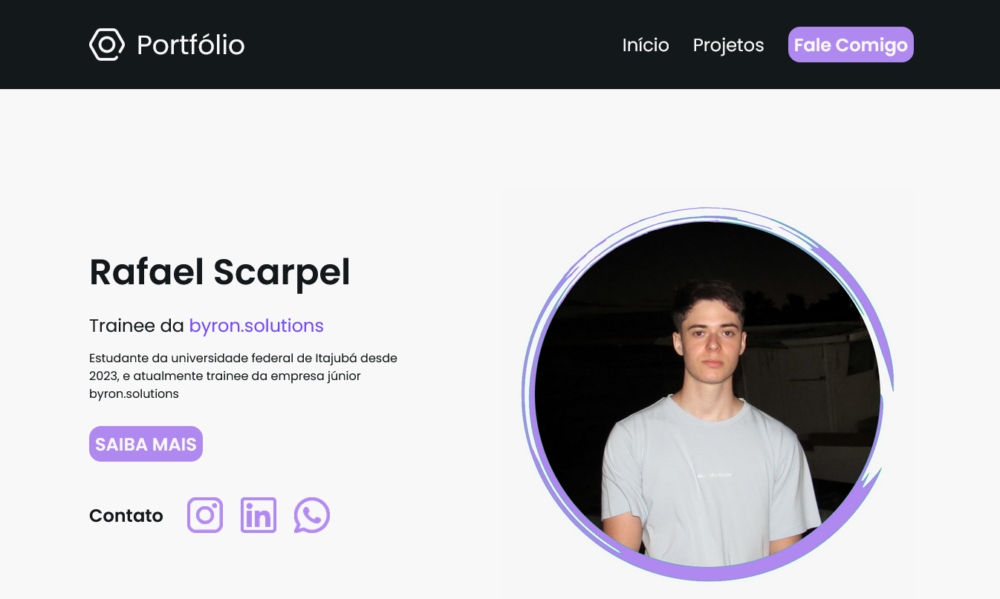

# Sobre 
Esse repositório contém a segunda página desenvolvida na capacitação web da empresa júnior byron.solutions, agora incorporando o uso de Tailwind

# Preview

# Estrutura
A página é um portfólio pessoal, estruturado com uma header; Uma seção com resumo pessoal, foto e links para contato;
Uma seção com os últimos projetos realizados e um footer com informações gerais.
